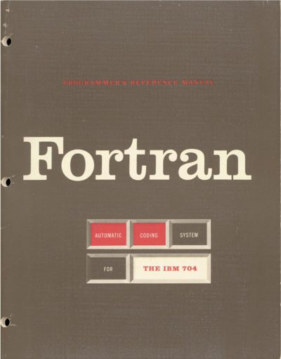
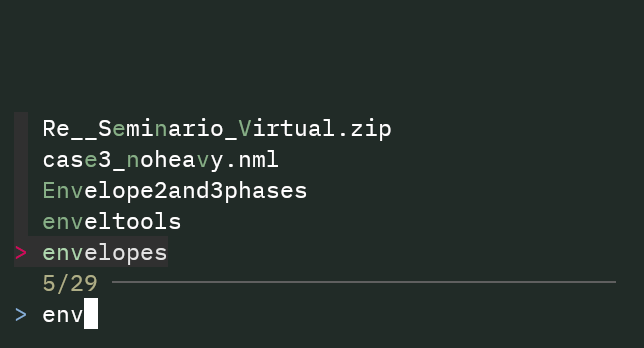

# Trabajar con Fortran



## Pasos previos
- Se asumen que se cumplieron los [requisitos principales del curso](../README.md#Requisitos)
- Realizar la instalación de las [herramientas adicionales para Fortran](https://github.com/ipqa-research/fortran-setup)

## Qué vamos a ver hoy?
- Ejecutar códigos Fortran.
- Estructurar un proyecto.
- Formatear consistentemente el código.

## Que **no** vamos a ver hoy
Syntaxis de Fortran, no vamos a meternos en el lenguaje en sí, sino en todo lo
que lo rodea.

## Caso de aplicación
Vamos a ver lo más importante con un ejemplo aplicado

### Generar un nuevo proyecto
```bash
# El nombre de proyecto _no_ puede tener espacios!
fortran_project new "nombre_projecto"
```

Todos los proyectos se generan por defecto en `~/codes`, cada uno en una nueva
carpeta.

### Abrimos el proyecto
Para abrir nuestros proyectos simplemente ejecutamos

```bash
fortran_project work
```

Lo que nos mostrará una lista de los proyectos y podemos seleccionar en cual
deseamos trabajar. Similar a la siguiente:



Donde se puede tanto seleccionar con un click o escribir el nombre del
proyecto.

Seleccionar el proyecto abrirá el mismo en `vscode`, ya listo para trabajar.

### Ejecución
Desde la terminal de `vscode` podemos ver que está abierto el directorio del
proyecto. Así que al proyecto lo podemos correr simplemente con: 

```bash
fpm run
```

### Agregar una dependencia
En la carpeta del proyecto existe un archivo `fpm.toml`, donde podemos
ver la configuración general del proyecto.

Se puede agregar una dependencia agregando al final del archivo:

```toml
[dependencies]
# Libreria estandar de Fortran, debería de ir _siempre_.
stdlib="*"
# Librería de ecuaciones de estado
yaeos = {git="https://github.com/ipqa-research/yaeos", tag="v0.1.0b2"}
```

Al aclarar `tag` estamos pidiendo una versión específica de la librería. Así
que si en un futuro la versión más nueva cambia bruscamente nuestro código
no se rompe.

### Flasheamos un poco
Ponemos esto en el archivo `app/main.f90`

```fortran
program main
    use yaeos, only: pr, EquilibriaState, flash, PengRobinson76, ArModel
    implicit none

    class(ArModel), allocatable :: model
    type(EquilibriaState) :: flash_result

    real(pr) :: tc(2), pc(2), w(2)

    real(pr) :: n(2), t, p, k0(2)
    integer :: iter

    n = [0.4, 0.6]
    tc = [190.564, 425.12]
    pc = [45.99, 37.96]
    w = [0.0115478, 0.200164]
    model = PengRobinson76(tc, pc, w)

    P = 60
    t = 294
    k0 = (PC/P)*exp(5.373*(1 + w)*(1 - TC/T))
    print *, "K0: ", k0

    print *, "Running Flash!"
    flash_result = flash(model, n, t=t, p_spec=p, k0=k0, iters=iter)

    print *, "X:", flash_result%x, sum(flash_result%x)
    print *, "Y:", flash_result%y, sum(flash_result%y)
    print *, "Vx: ", flash_result%Vx
    print *, "Vy: ", flash_result%Vy
    print *, "P: ", flash_result%p
    print *, "T: ", flash_result%T
end program
```

Corremos de nuevo con `fpm run`, y yatá. Podemos jugar con parámetros en el 
archivo main y volver a correr.

> Protip:
> `fpm run --profile release` hace que la compilación optimize el código
> y corra más rápido.


Listo, ya sabemos lo esencial para correr un código Fortran. No fue tanto
quilombo

## Conceptos generales

### Compiladores

## Configuaraciones de `vscode`

## Bonus track
Cositas extra que son útiles

### Pre-procesadores de código
