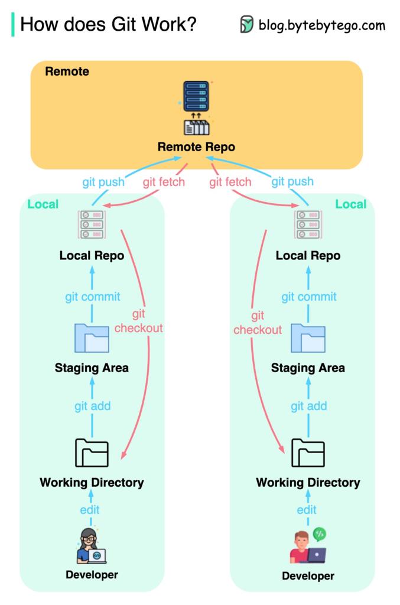

# Tutorial de git

Git es una herramienta de control de versiones muy poderosa que te permite
rastrear cambios en tus proyectos de software. Aquí tienes una guía rápida para
comenzar a usar Git.

Git es un sistema de gestión de versiones local, pero existen múltiples
herramientas remotas que permiten su sincronización con la nube. Siendo la más
común [GitHub](https://github.com/). En esta clase se asume una cuenta en
GitHub ya creada.


## Flujo de trabajo general con `git`

- Edito archivos
- Para cada archivo:
  - Dejo anotados los cambios (el Δarchivo)
- Sacar una foto de todos esos cambios y darle una descripción



_Recomendación_: Ejecutar los comandos que se muestran desde la terminal de
`vscode`

## Instalación

Primero, necesitas instalar Git en tu sistema. Puedes descargarlo desde
[git-scm.com](https://git-scm.com/) e instalarlo siguiendo las instrucciones
para tu sistema operativo.

> En el caso de utilizar una distribución Linux basada en Debian (como Linux
> Mint), o WSL instalar con:
>
> ```bash
> sudo apt install git
> ```
>
> Aunque suele estar pre-instalado.

## Configuración Inicial

Después de instalar Git, configura tu nombre de usuario y tu dirección de
correo electrónico. Esto se utilizará para identificar tus contribuciones en
los registros de cambios.

```bash
git config --global user.name "Tu Nombre"
git config --global user.email "tu@email.com"
git config --global pull.rebase true
```

## Iniciar un Repositorio

Para comenzar a rastrear cambios en un proyecto, navega hasta el directorio de
tu proyecto en la línea de comandos y ejecuta:

```bash
git init
```

Esto creará un nuevo repositorio Git en ese directorio.

## Añadir Archivos

Antes de poder rastrear los cambios en tus archivos, debes agregarlos al área
de preparación (staging area) usando el comando git add.

```bash
git add nombre_del_archivo
```

También puedes añadir todos los archivos con cambios al área de preparación
usando *no recomendado*:

```bash
git add .
```

### Realizar un Commit

Una vez que hayas añadido los archivos que quieres guardar, puedes crear un commit para guardar los cambios en el repositorio.

```bash
git commit -m "Mensaje de commit descriptivo"
```

### Revisar el Historial de Commits

Puedes ver el historial de commits en tu repositorio utilizando:

```bash
git log

```

O, más bonito:

```bash
git log --oneline --graph
```

Este comando mostrará todos los commits, junto con información como el autor,
la fecha y la hora, y el mensaje del commit.

## Trabajar con Ramas


Las ramas te permiten trabajar en diferentes versiones de tu proyecto de forma
simultánea. Para crear una nueva rama, usa:

```bash
git branch nombre_de_la_rama
```

Para cambiar a una rama existente, puedes utilizar:

```bash
git checkout nombre_de_la_rama
```

O, desde Git 2.23 en adelante, puedes usar:

```bash
git switch nombre_de_la_rama
```

### Fusionar Ramas

Una vez que hayas realizado cambios en una rama y quieras combinarlos con otra
rama, puedes hacerlo usando el comando git merge.

```bash
git checkout rama_destino
git merge rama_fuente
```

## git me tiene re podrido con archivos que no me interesa seguir!

Para eso se puede crear el archivo `.gitignore` en el directorio principal del
repositorio. Donde agregamos los archivos que no queremos que se agreguen al
control de versiones. Permite el uso de caracteres especiales como `*`.

Un archivo que contiene:

```
nosigas-*
src/ignorar-*
docs/numero_tarjeta_credito.txt
```

Ignoraría todos los archivos que empiecen con `nosigas-`, los que empiecen con
`ignorar-` en la carpeta `src` (sin incluir subcarpetas, a esos si los
seguiría) y al `docs/numero_tarjeta_credito.txt`.


## Trabajar con repositorios remotos
Todo muy bien con trabajar localmente, es muy útil, pero a mí me dijeron que
esto ayuda a trabajar colaborativamente...

Así es! Para vincular un repositorio con un repositorio online existen
distintas formas. Nosotros vamos a trabajar GitHub

## GitHub
GitHub es una plataforma online donde se alojan repositorios `git`.

A partir de ahora asumimos que ya hicieron la cuenta en GitHub

Para logearse en gh desde la terminal se utiliza la applicación `gh`

```bash
sudo apt install github-cli
gh auth login
```

Algunos editores como `vscode` lo realizan automáticamente.

- Parto de un repositorio local y quiero crear un repositorio remoto.
Es necesario generarlo desde la página en que se va a trabajar (ejemplo en
sección de GitHub)

> ```bash
> git remote add origin <link al repositorio remoto>
> ```

- Ya existe un repositorio remoto y quiero replicarlo en mi máquina

> ```bash
> git pull <link al repositorio remoto>
> ```

### Actualizar tu Repositorio Local

Para obtener los últimos cambios desde un repositorio remoto, utiliza:

```bash
git pull
```

Esto va a traer todos los cambios que se hayan echo en el remoto.

> Ojo!
>
> 1. Para hacer un pull es necesario haber commiteado nuestros cambios locales.
> 2. Puede que esto genere conflictos.

### Enviar Cambios al Repositorio Remoto

Si quieres compartir tus cambios con otros o respaldarlos en un repositorio
remoto, utiliza:


```bash
git push origin nombre_de_la_rama
```

Esto enviará tus cambios desde la rama local al repositorio remoto.
