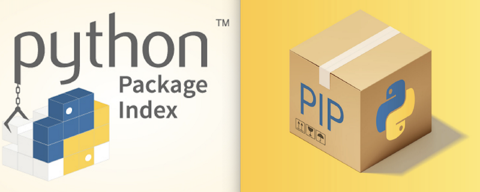
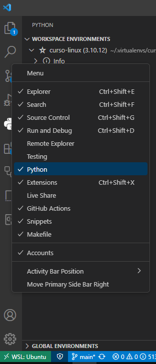
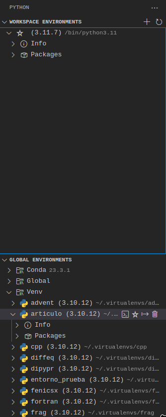

### Curso: "Empezar a usar Python bien"


### ADVERTENCIA
Se presume que el lector ha adquirido los conocimientos concernientes al curso
de terminal de este mismo repositorio.


### ¿Qué es este seminario?
Una guía orientativa para la correcta configuración de un entorno de trabajo
con el lenguaje Python, saludable, reproducible y que no nos mate en el
intento; orientada principalmente al sistema operativo Linux o a WSL en
Windows.


### ¿Qué NO es este seminario?
Un curso sobre el lenguaje Python. Se presume que el lector sabe Python o que
será capaz de asimilar los conocimientos sobre el "meta" uso de Python sin
necesidad de saber nada sobre el lenguaje (lo cual sería el mejor acercamiento
al lenguaje nunca antes visto).


### Historia
Wikipedia: 

Python es un lenguaje de alto nivel de programación interpretado cuya filosofía
hace hincapié en la legibilidad de su código, se utiliza para desarrollar
aplicaciones de todo tipo, por ejemplo: Instagram, Netflix, Spotify, Panda3D,
entre otros.2​ Se trata de un lenguaje de programación  multiparadigma, ya que
soporta parcialmente la orientación a objetos, programación imperativa y, en
menor medida, programación funcional. Es un lenguaje interpretado, dinámico y
multiplataforma.

El nombre del lenguaje proviene de la afición de su creador por los humoristas
británicos Monty Python.

Guido van Rossum es el principal autor de Python, y su continuo rol central en
decidir la dirección de Python es reconocido, refiriéndose a él como
Benevolente Dictador Vitalicio (en inglés: Benevolent Dictator for Life, BDFL)


    Entonces, ¿qué van a hacer todos ustedes? ¿Crear una democracia? ¿Anarquía?
    ¿Una dictadura? ¿Una federación? -- Guido van Rossum

#### Versiones de Python
Las versiones de Python se encuentran divididas en dos, 2.x y 3.x. La última
versión de Python 2.x es 2.7, la cual ya está descontinuada. La versión más
moderna de Python es 3.12.


### Administrador de paquetes de Python (pip)



Pip es un sistema de gestión de paquetes utilizado en Python para instalar y
administrar bibliotecas y herramientas adicionales que no forman parte de la
biblioteca estándar de Python. 
    
Con Pip, los usuarios pueden instalar paquetes fácilmente desde el repositorio
PyPI (Python Package Index) o desde archivos locales.

Instalar pip

```shell
    sudo apt update

    sudo apt install python3-pip
```

Checkear la instalacion:

```shell
    pip3 --version
```


### Trabajar en entornos virtuales

Trabajar en entornos virtuales con Python es esencial para garantizar la
estabilidad, la consistencia y la portabilidad de tus proyectos. La falta de
ellos puede llevar a conflictos de dependencias y dificultades en la
colaboración y el mantenimiento a largo plazo.

Ventajas:

- Evita el conflicto de dependencias entre un proyecto y otro.
- Permite reproducir un entorno de trabajo (usar la misma versión de Python y
  misma versión de bibliotecas que se utilizaron en el pasado).
- Evita la pérdida de dependencias por sobrescritura (tan graves como las
  dependencias del sistema operativo).


### ¿Qué es un entorno virtual de Python?

Muchos estarán acostumbrados al concepto de máquina virtual; sin embargo, un
entorno virtual de Python no tiene nada que ver con eso.

Un entorno virtual, o virtual environment, es un intérprete de Python aislado
del intérprete del sistema y de los intérpretes de otros entornos virtuales.
Las bibliotecas instaladas en él son copias específicas para ese entorno.

Por ejemplo, si creamos dos entornos virtuales (ve1 y ve2) con una versión de
Python 3.11 e instalamos la biblioteca NumPy en ambos, estaríamos instalando
dos veces la biblioteca NumPy en nuestro sistema. Estas dos copias de NumPy
instaladas no tienen conocimiento de la existencia de la otra ni tienen
relación entre sí. Esa es la idea...


### ¿Cómo creo entornos virtuales de Python?

Se debe instalar la libreria `virtualenv` y además la librería
`virtualenvwrapper` con el administrador de paquetes de Python, que si bien es
opcional, no hará las cosas mas sencillas.

Desde una terminal:

```shell
    pip install --user virtualenv virtualenvwrapper
```

Editamos el archivo .bashrc añadiendo las lineas:

    export WORKON_HOME="$HOME/.virtualenvs"
    export VIRTUALENVWRAPPER_PYTHON=/usr/bin/python3
    source $HOME/.local/bin/virtualenvwrapper.sh

Esto permitirá que nuestras terminales puedan utilizar los comandos
proporcionados por `virtualenvwrapper`. No olvides reiniciar la terminal para
que surta efecto.


### Comandos para administrar nuestro entornos

- Crear entorno virtual (make virtual environment)
```shell
    mkvirtualenv nombre_entorno
```

Al crearse el entorno inmediatamente la terminal entrará en el. Esto será
indicado en el prompt de nuestra terminal:


- Salir de un entorno virtual

```shell
    deactivate
```

- Entrar en un entorno virtual
```shell
    workon nombre_entorno
```

- Borrar un entorno virtual (remove virtual environment)
```shell
    rmvirtualenv nombre_entorno
```

- Ver la lista de mis entornos virtuales creados
```shell
    workon
```

Existen funcionalidades más avanzadas de `virtualenv` que por el momento no son
necesarias (por ejemplo, crear un entorno con uan versión de Python especifica)


### Instalar librerías en un entorno

- Creamos un entorno de ejemplo:

```shell
    mkvirtualenv thermo
```

 Corroboramos que estemos dentro del entorno gracias a nuestra prompt o también
podemos hacer:

```shell
    which python3
```

- Instalamos una librería ejemplo que se encuentre en PyPi:

```shell
    pip install ugropy
```

- Para instalar librerías locales
```shell
    pip install path/to/library/directory
```

- Para instalar librerías locales en modo editable
```shell
    pip install -e path/to/library/directory
```

- Instalar librerías a partir de un archivo requirements.txt
```shell
    pip install -r requirements.txt
```

*Ver archivo ejemplo de requirements.txt del seminario

    matplotlib
    black
    black[jupyter]
    scipy
    numpy
    pandas == 2.2.0
    thermo >= 0.2.27

- Ver la lista de librerías instaladas en el entorno
```shell
    pip list
```

### Extensión de VScode


### Como trabajar con el lenguaje Python

#### Archivos *.py
Es el equivalente a un .f90 de Fortran. En estos archivos podemos escribir
nuestro código Python. Dentro de estos archivos podemos escribir nuestro código
Python y correrlo de la terminal con:

```shell
    python3 python/examples/example1.py
```

*Ver la carpeta "examples" de este seminario.

También, es posible correr un archivo *.py utilizando el botón correr (▶). Si
recibió un error al hacer esto con el example1.py, era lo esperado.

VScode no sabe con cual intérprete de Python se está queriendo correr el
archivo, por lo que usa el intérprete del sistema por defecto.

Para cambiar el intérprete que utiliza VScode se debe hacer:

    ctrl + shift + p

Y buscar la opción:

    Python: select interpreter

o en español:

    Python: seleccionar intérprete

Se desplegará una lista de intérpretes a seleccionar. Debería figurar el
entorno virtual creado. Seleccionarlo.

Una forma alternativa y más visual de hacer esto. Hacer click derecho y
habilitar el menú de Python como se muestra en la figura:



Dentro de la pestaña nueva correspondiente a Python seleccionar el entorno
virtual como el intérprete del espacio de trabajo.



En este caso estoy seleccionando un entorno llamado curso-linux. 

Si son curiosos notarán que desde esta pestaña se pueden gestionar todos los
entornos virtuales, crearlos, borrarlos, ver que librerías tienen, etc. Incluso
entornos de otras distribuciones de Python como Anaconda.


#### Formatear archivos .py
Es bueno seguir un estandar a la hora de programar. Los estandares se definen
por lo que uno podría definir su propio estandar pero eso no es conveniente por
obvias razones. A la hora de interactuar con otros desarrolladores todos
deberían tener un estandar en común.

En Python existe un estandar gratuito que se puede consultar llamado PEP8.

https://peps.python.org/pep-0008/

Esto es muy extenso y aprender absolutamente todo sobre esto llevaría mucho mas
tiempo y sobre todo práctica por parte de los oyentes.

- Funciones:  Usa nombres descriptivos y sigue la convención snake_case (todo
  en minúsculas y separado por guiones bajos).

- Clases: Utiliza la convención CamelCase para nombrar clases (inicia cada
  palabra con mayúscula sin espacios ni guiones).

- Variables: igual que funciones.

- Longitud máxima de linea: 79 caracteres.

En este tutorial solo exploraremos el último item que puede ser corregido
automáticamente por la biblioteca `black`. Ver el ejemplo
python/examples/formateo_py/codigo_feo.py

```shell
    black python/examples/formateo_py/ -l 79
```

Ver como el código ha cambiado


#### Archivos *.ipynb
Los Jupyter Notebooks son entornos interactivos de computación que permiten
crear y compartir documentos que contienen código ejecutable, visualizaciones,
texto explicativo y elementos multimedia. Estos documentos se organizan en
celdas, donde cada celda puede contener texto en formato Markdown o código en
un lenguaje de programación como Python, R, Julia, entre otros.

Una de las principales ventajas de los Jupyter Notebooks es su capacidad para
ejecutar código de manera interactiva, lo que significa que puedes escribir y
ejecutar fragmentos de código de forma independiente en cualquier orden. Esto
facilita la exploración de datos, el prototipado de algoritmos y la
presentación de resultados.

*Ver el archivo python/examples/example1.ipynb

#### Seleccionar el intérprete de Python  del notebook
Al igual que con los archivos .py hay que seleccionar el intérprete del 
notebook utilizando el boton "select kernel" en la parte superior derecha.

#### Formateo de archivos .ipynb
Al igual que los archivos .py se pueden formatear con black instalando el
complemento black[jupyter]

```shell
    pip install black[jupyter]
```

