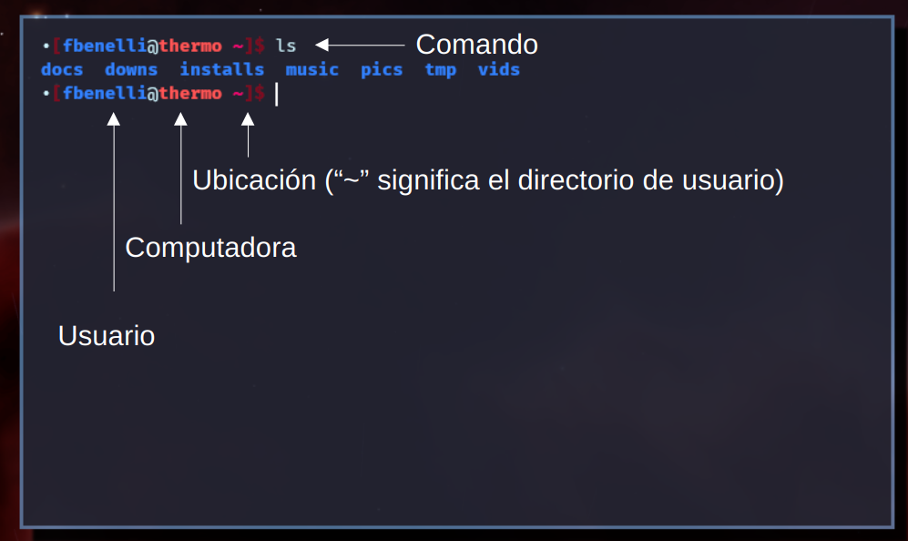

# La terminal de Linux

## Qué es?

La terminal de Linux es una interfaz de línea de comandos que permite a los
usuarios interactuar con programas mediante la ejecución de comandos
escritos en texto, proporcionando un medio _eficiente y versátil_ para
realizar tareas de administración, gestión de archivos y programación.

## Ventajas

Entre las principales ventajas de trabajar con una terminal se encuentran:

- Flexibilidad y personalización
- Eficiencia en gestión de archivos y tareas
- Automatización
- Acceso remoto

## Terminal



## Ejecución de comandos

Un comando de terminal tiene la siguiente estructura

```bash
comando argumento1 argumento2 --flag1 --flag2 -f1
```
- Comando: El nombre del programa que se ejecuta.
- argumento[12]: Los argumentos que recibe el programa.
- --flag1: Se llaman "flags" o "switches", suelen ser opciones particulares.
- -f: Las flags suelen tener abreviaciones.


A modo de ejemplo podemos ejecutar el comando de calendario:

```bash
cal
```

```bash
cal -3
```

```bash
cal --help
```

## Comandos más importantes

### Navegación
- `pwd`: Nos muestran donde estamos parados.
- `ls` : Nos muestra los archivos de donde estamos.
- `cd` : "Cambiar directorio"

### Manipulación de archivos y directorios
- `mkdir`: Crear directorio
- `mv` : Mover
- `cp` : Copiar (para copiar directorios se añade la flag `-r`)
- `rm` : Remover (para remover directorios se añade la flag `-r`)
- `cat`: Mostrar contenido de archivo
- `head` y `tail`: Mostrar comienzo o fin de un archivo
- `grep`: Buscar texto en archivo


> En el caso de `mkidr`, `mv`, `cp` y `rm` siempre es bueno agregar la flag
> `-v` (de "verboso"), la cual devuelve un texto que confirma la acción
> realizada.

### Trabajo con texto
- `sort`: Ordenar (usar `sort -n` para números)
- `uniq`: Dejar solo valores únicos
- `wc`: Contar palabras, líneas y letras
- `sed`: Modificar texto
- `awk`: Manipular columnas

### Redirecciones
- `>`: Enviar los prints a un archivo. Lo crea si no existe y sobreescribe lo
       que exista (`>>` añade al final de un archivo)
- `|`: Redirigir los prints a un comando.
- `<`: Redirigir los contenidos de un archivo a un comando.


## `.bashrc`
Cada vez que se abre una terminal nueva, se corre automáticamente una secuencia
de comandos de configuración previa, esta secuencia se encuentra en el archivo
`~/.bashrc` y puede ser modificada (preferentemente no tocar nada pero si
agregar pasos extra al final).

Una simple prueba es abrir el archivo y agregar una nueva línea al final:

```bash
echo "Hola desde .bashrc!"
```

## Aliases
A veces un comando se utiliza mucho y tiene sentido resumirlo. Esto se hace
mediante un alias. Por ejemplo quiero un comando que abra `vscode` en un lugar
particular.

```bash
alias eos="code docs/research/thermo/algos/yaeos"
```

Los aliases solo duran durante la sesión de la terminal. Para hacerlos permanentes
es necesario agregarlos al archivo `.bashrc`. El archivo donde se guardan
las configuraciones de la terminal.

```bash
# Se agregan escapes a las comillas
echo alias eos=\"code docs/research/thermo/algos/yaeos\" > ~/.bashrc
```

## Scripts
A veces queremos resumir una secuencia de comandos, no un único comando.
Para esto se puede realizar un script. Un script es un archivo que contiene
una secuencia de comandos a realizar.

```bash
#!/bin/bash
# ~/.local/bin/fortran_project.sh

nombre=$1  # Primer argumento

# Crea una carpeta 
fpm new "$nombre"

# Ir a la nueva carpeta
cd "$nombre"

# Añade configuraciones generales de vscode al proyecto
git submodule add "git@github.com:ipqa-research/vscode-fortran.git" .vscode
```

Teniendo la secuencia en un archivo

# Tarea y referencias extra


## General
- [Ejercicios *simples* de terminal](https://linuxjourney.com/lesson/the-shell)
- [Video sobre uso de terminal](https://www.youtube.com/watch?v=W4gE8k2RE_s&t=1581s)

## Maniplacion de archivos
Crear una carpeta de trabajo para todas las cosas del curso. Dentro del
  directorio `~` del usuario.

## Redirecciones
Usando los comandos `fortune`, `cowsay` y `figlet` (de no estar instalados
instalarlos con `sudo apt-get install fortune cowsay figlet`.

- Correr `fortune`
- Guardar el output en un archivo
- Redirigir el contenido del archivo a `cowsay`
- Usar la imaginación con `figlet`

## Scripts
Generar un script que lleve a esa carpeta (nota: los scripts pueden luego
moverse a `~/.local/bin` para volverlos accesibles en cualquier momento desde
la terminal, para eso es necesario volverlo ejecutable con `chmod +x
~/.local/bin/nombre_archivo_script`)

## `.bashrc`
- Hacer que los comandos `mkdir`, `mv`, `cp`, `rm` siempre sean verbosos.
  Correr esos comandos con la flag de ayuda (`--help`) y ver si no hay alguna
  flag extra que estaría bueno que esté siempre.
   <details>
     <summary>Ayuda</summary>
     Buscar alguna flag relacionada a sobreescribir (overwrite) archivos.
   </details>
- Hacer que la terminal muestre el calendario cada vez que la abro.
